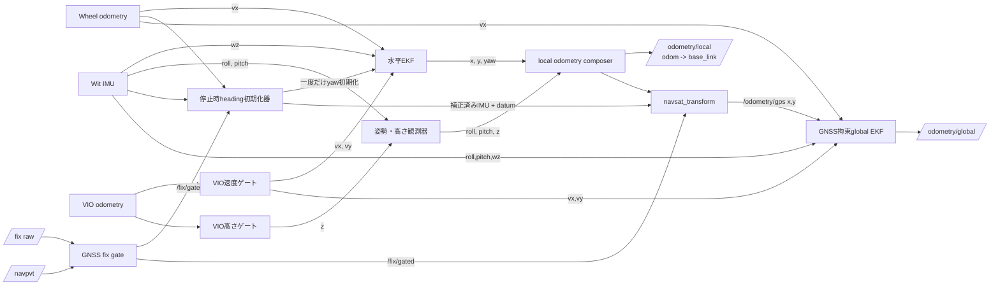
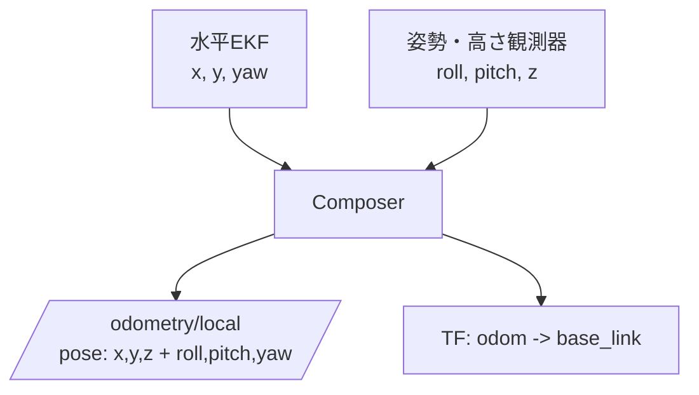
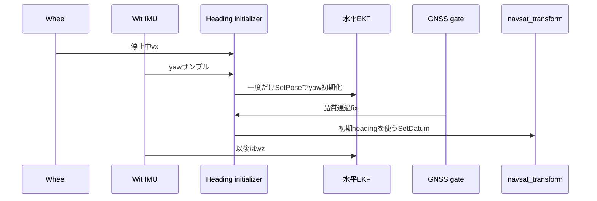
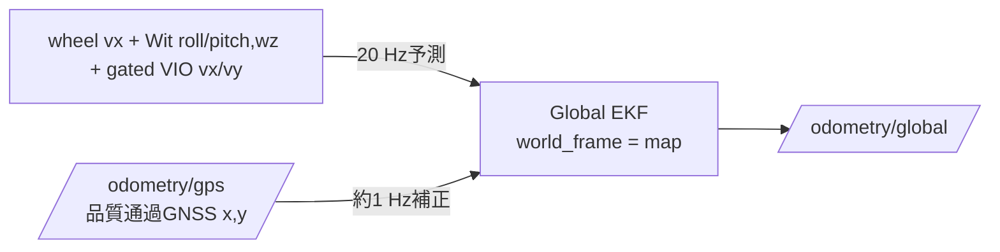
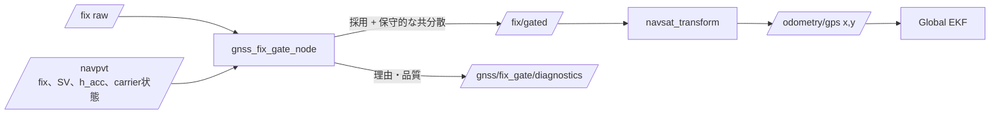

# 自己位置推定の再設計：ステップ1〜5

この文書は、明示的に`localization_mode:=separated_offroad`を指定した
場合の構成を説明するものです。既存の`legacy`構成は維持しており、
ステップ2〜5によって既定の挙動が変わることはありません。

## 目的

従来は、local EKFが既に融合したposeをglobal EKFへ入力していました。
そのため、低頻度GNSS更新が相関を持つlocal poseと競合し、VIOリセットや
磁気yawの誤差が必要以上に多くの状態量へ影響していました。

再設計では、次の三つを独立させます。

- 水平のデッドレコニング
- 姿勢と高さの推定
- GNSSによる地図座標系での絶対位置拘束

## 全体のデータフロー



`/odometry/local`は下流ノードとの互換性とTFのために残しますが、新しい
global EKFの入力には使用しません。

## ステップ1 — `/odometry/gps`の復旧

### 原因

ROS 2 Foxy版の`robot_localization`にある`navsat_transform_node`は、IMUを
相対トピック名`imu`で購読します。launchでは`imu/data`をremapしていたため、
navsat_transformは`/wit/imu`を一度も受信できず、初期化に失敗して
`/odometry/gps`を出力していませんでした。

### 修正と検証

対象launchのremapを次のように修正しました。

```python
("imu", "/wit/imu")
```

7月bagの20秒再生では、`/odometry/gps`は0件から34件になりました。
実機の受入条件は、起動直後を除き`/fix`と`/odometry/gps`がともに概ね
1 Hzで継続して出力されることです。

## ステップ2 — 水平状態と姿勢・高さの分離

水平EKFは、意図して平面状態だけを扱います（`two_d_mode: true`）。

| 入力源 | 水平EKFで使う要素 | 意図的に除外する要素 |
|---|---|---|
| Wheel odometry | `vx` | pose、yaw |
| Wit IMU | `wz` | 磁気orientation |
| VIO（速度ゲート通過後） | `vx`, `vy` | pose、orientation、z |

これはUGVが物理的に平坦な場所だけを走る、という意味ではありません。
roll、pitch、zは別の姿勢・高さ観測器で扱います。

- roll/pitch：Wit orientation
- z：`vio_vertical_gate_node`を通過したVIO zだけ
- IMU加速度の二重積分は使わない
- VIOの鉛直情報が異常になった場合、最後に検証済みだったzを保持する



`vio_twist_gate_node`は有限値、速度、鉛直速度、速度の急変を検査し、
異常後は一定時間の健全性確認後にだけ再投入します。
`vio_vertical_gate_node`はzを独立に保護します。これによりVIOリセットが
水平位置・yaw・高さを直接リセットすることを防ぎます。

7月・8月bagの再生結果は
`pm_evaluation/results/separated_offroad_localization/`に残しています。
8月の結果は、VIO破綻を隔離できたことの検証であり、GNSS基準の絶対精度を
示すものではありません。

## ステップ3 — 地球基準headingの一回初期化

gyro `wz`は局所yawの伝播に適しますが、北基準の向きは与えません。また、
GNSSアンテナが一つだけでは停止時の車体headingを決められません。

そこで、以下の方式を選びました。

1. `|wheel vx| <= 0.03 m/s`の停止中だけ、Wit yawを100サンプル円平均する。
2. 円標準偏差が0.10 rad以下であることを確認する。
3. `/set_pose`を使い、水平EKFのyawを一度だけ初期化する。
4. 以後のyawは連続的な磁気yawではなく`wz`で伝播する。
5. 有効なgated GNSS fixも得られた時点で、`/datum`により
   navsat_transformのdatumを設定する。

`heading_initializer_node`は`/wit/imu/heading_calibrated`を出力します。
roll/pitch、角速度、加速度は保持し、`yaw_correction_radians`だけを加えます。
この値はいま意図的に`0.0`です。これは「今の磁気yawが正しい」ことを意味
せず、今後の取付角・地磁気校正で得る固定補正値の設定箇所です。



7月bag再生の未校正値では、初期yawは2.819 rad（161.5度）、円標準偏差は
0.005 radでした。GNSS/OSM重畳結果は
`pm_evaluation/results/heading_initialization/.../gnss_osm_overlay/`にあります。
ただし、搭載状態でのheading校正値が未確定であるため、これは比較用の基準
結果であり運用上のheading精度を示すものではありません。

## ステップ4 — GNSS拘束型global EKF

global EKFはmap座標系での位置を担当し、`/odometry/local`のposeを入力に
使いません。生で解釈可能な入力から20 Hzで予測し、GNSSを本来の約1 Hzで
map x/yの絶対位置補正として使います。

| 入力 | global EKFで使う状態量 | 除外する状態量 |
|---|---|---|
| Wheel odometry | `vx` | pose、yaw |
| Wit IMU | roll、pitch、`wz` | 磁気yaw |
| Gated VIO | `vx`、`vy` | pose、orientation、z、`vz` |
| `/odometry/gps` | map `x`、`y` | z、orientation、velocity |



GNSS更新の間は速度に基づく予測で連続性を保ちます。global出力のroll/pitchは
Wit由来で、yawは一回初期化後の`wz`による伝播です。global zについては、
GNSS altitudeとVIO鉛直状態の品質モデルが未検証なため、まだ絶対位置として
は融合していません。

## ステップ5 — GNSS品質ゲート

GNSS品質ゲートは、粗悪な緯度経度がmap座標へ変換される前に遮断します。
RTK FIXでない測位を全て捨てるのではなく、共分散を保守的にして弱い観測と
してglobal EKFへ渡します。



`gnss_fix_gate.yaml`の現在の判定条件は以下です。

- `NavSatFix`がNO_FIXでなく、緯度経度が有限値
- NAV-PVTの取得から2.5秒以内、3D fix、かつ`GNSS_FIX_OK`
- 衛星数6以上、`h_acc <= 20 m`
- `3 m + 5 m/s × 経過時間`を超える位置ジャンプは棄却
- 起動後または棄却後、3回連続の正常fixを確認してから再採用

水平1σ共分散は、receiver報告共分散、`h_acc`、解の種類ごとの下限のうち
最大値を使います。

| NAV-PVTのcarrier解 | 水平1σの下限 |
|---|---:|
| RTK fixed | 0.5 m |
| RTK float | 2 m |
| standalone / DGNSS | 10 m |

生の`/fix`と`/navpvt`、採用後の`/fix/gated`、診断
`/gnss/fix_gate/diagnostics`は全てbagへ記録します。将来は、map座標系の
予測位置とのinnovation検定も有用です。ただしglobal EKFのGNSS更新後の状態を
そのEKF自身の採否判定へ戻す循環構造にはしない設計が必要です。

## 実行方法と確認項目

```bash
ros2 launch pm_bringup pm_bag_global_localization.launch.py \
  localization_mode:=separated_offroad

ros2 topic hz /fix /fix/gated /odometry/gps
ros2 topic echo --once /gnss/fix_gate/diagnostics
```

初期の3回連続正常fixを通過後、三つのトピックはいずれも概ね1 Hzとなるのが
正常です。`/fix`だけがあり`/fix/gated`が出ない場合は、先に記録された診断の
棄却理由を確認してから閾値を変更してください。
