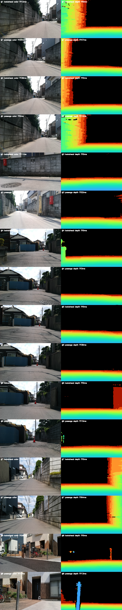

# 7月bag：走行経路上の黒hazard原因調査

評価日：2026-09-23  
対象bag：`bags/rosbag2_2026_07_26-09_17_38`  
再生：1倍速、現行ワークスペースのlocalization/perception

## 結論

実走行経路上で中心セルが観測済みだった325地点のうち41地点（12.6%）がhazard=100
（RVizでは黒）だった。中心黒41地点ではslopeが31地点（75.6%）に関与し、roughnessは
16地点、stepは20地点、obstacleは5地点に関与した（cueの重複あり）。黒は4 cueのうち1つ
だけで起きるとは限らず、19/41地点では複数cueが同時に閾値へ達していた。

代表的な黒区間のカラー画像は舗装路・住宅路が中心で、画像上に明瞭な大段差が見えない
地点も多い。一方、地図の局所標高は3×3近傍で大きくばらつく地点を含み、component値が
上限表示へ張り付いていた。現行実装は5 cm cell内の最小zをground候補とするが、外れ値を
棄却するロバスト判定はない。**いまの証拠で最も疑わしいのは、疎なdepth sampleから選んだ
ground候補の混入／depthノイズが局所平面・残差・stepへ伝播すること**である。ただし、保存済み
gridには各cellを作った生pixel・depth候補・平面supportが残らないため、個々の黒地点について
ground候補誤りとdepth外れ値のどちらだったかまでは断定できない。

姿勢が主因という証拠は今のところ弱い。黒地点で使われたodom姿勢のrollは中央値1.61°、
最大4.03°、pitchは中央値0.31°、最大1.69°だった。depth stampでのTF lookup失敗は再生中
ゼロで、depth画像と選択したmapの時刻差も0–47 msだった。ただしIMU取付角・姿勢bias・
画素ごとのraw depthの誤りまではこの確認で排除できない。

なお、odom zは全軌跡で約-0.80〜+1.72 mと大きく変動し、ログにはVIO zの1.727 m jumpによる
鉛直gate latchも記録された。しかしStage 3.1のfeatureはrelative elevationを使い、各depth
点から同じtimestampのcamera zを差し引いているため、共通のodom-z offsetだけでは局所slope/
roughnessを説明しにくい。z品質はabsolute elevation mapの課題として別途要確認だが、今回の
黒hazardの第一原因と決めつける根拠はない。

## 黒になったcueの内訳

中心黒41地点のcue組合せ（1地点は複数に重複計上）：

| 閾値に達したcue | 地点数 |
|---|---:|
| slopeのみ | 16 |
| slope + roughness + step | 10 |
| slope + step | 3 |
| roughness + step | 2 |
| roughness + step + obstacle | 2 |
| slope + roughness | 2 |
| stepのみ | 3 |
| obstacleのみ | 3 |

このため「黒の一番多い原因」はslopeだが、残りの黒も無視できない。roughness単独はなく、
roughnessはすべて他cueとの同時発生だった。obstacle-only 3地点はカラー画像に写るcone等の
実物体が関係した可能性があり、直ちに誤検出とは言えない。

RViz用component mapは0–100へ線形量子化し、上限以上を100に飽和させている。このCSVから
復元した値もその表示値であり、例えばslope=20°は「20°ちょうど」ではなく「20°以上」です。
黒の強さや超過量をこの値からは比較できない。

## 画像・地図・姿勢を突き合わせた観察

黒中心の時系列連続runは29区間、最長4サンプルだった。代表区間をcue組合せ別に選び、各区間の
中心時刻について、hazard map生成時と約2 m先を実際に通過した時刻のRGB/depth画像を抽出した。

depth画像は表示用に0.4–4.0 mを疑似カラー化したもの。黒い画素は無効または範囲外depthであり、
hazard値ではない。代表画像では路面中央のdepthは連続した面に見える一方、壁・空・遠方には無効域
もある。画像の見た目だけでは、平坦な路面上の数cm〜数十cmのdepth外れ値を否定できない。

41黒中心地点の診断値は次のとおり。

| 項目 | 中央値 | 90 percentile | 最大 |
|---|---:|---:|---:|
| 局所相対標高3×3 range | 9.6 cm | 18.6 cm | 30.6 cm |
| 局所相対標高3×3 std | 3.6 cm | 8.3 cm | 12.1 cm |
| 3×3内の最小observation count | 1 | 3 | 5 |
| 3×3内の最大observation age | 0.7 s | 1.8 s | 5.0 s |

標高range/stdはOccupancyGridへ量子化されたdebug layerからの概算で、±0.30 m飽和と6 mm刻みの
影響を受ける。さらにこの近傍統計はfeature計算時のfresh-age maskと完全には一致しないため、
平面fitへ使われたraw sampleの厳密な残差値ではない。observation countはcellの累積画像観測回数で、
1画像内のpixel数やfeature fitの支持点数そのものではない。それでも、走行可能に見える舗装路の
一部に対して出力地形が粗く・疎であるという異常の兆候になっている。

## 原因候補の切り分け

### ground候補／depth外れ値：有力だが、個別pixelまで未確定

現在のfusionは画像ごとに同じ5 cm XY cellへ入った点の**最小zを1個のground sample候補**にする。
画素stride 4で点を間引き、セルごとの地面分類、外れ値除去、複数returnの分布保持はしていない。
そのため、壁端・植生・ステレオdepthの誤差などがセル最小値へ入ると、ground elevationが低くなり、
近傍平面のslopeや残差/stepを押し上げ得る。obstacle heightは同じセルの最大zとground候補との差を
使うため、地面以外のreturnと誤ったground候補が混ざる場合もある。

この仕組みは今回の候補を説明し得るが、今回保存した地図は融合後の値だけでpixel provenanceを
捨てている。画像上で滑らかな路面に見えることと、どのsampleが各黒cellを作ったかは別問題であり、
現段階で「depth外れ値が確定原因」とは言えない。

### 姿勢／TF：大きな姿勢逸脱・TF欠落は見えない

black centerでのroll/pitchは数度の範囲で、terrain featureの20°飽和を直接説明するほど大きくない。
map生成時のtimestamp付きTFはほぼ全区間利用できた（tf_drops=0。bag末尾停止時の未来TF不足を除く）。
ただし正しいtimestampのTFを使ったことは、IMUがbase_linkに正しく整列・校正されていることや、
姿勢に一定biasがないことの証明ではない。IMUのraw姿勢と、bagから再計算したlocal odom姿勢、
路面を平面と仮定して求めたdepth-derived姿勢の三者比較が必要。

### 他cue：全cueを個別に扱う必要あり

- slope：31/41地点に関与。16地点では単独原因。平坦路面に見えるのに繰返し20°へ飽和しており、
  まず優先して入力支持点とplane fitを監査する。
- roughness：16/41地点。単独ではなくslope/step等との重複。3 cmでの閾値とdepthノイズ・地面候補の
  混入に敏感。
- step：20/41地点。7 cmに飽和した地点を含むが、平面残差rangeと前後support gateを使う暫定値であり、
  実際の垂直段差を直接測った結果ではない。
- obstacle：5/41地点。3地点は他cueを伴わない。coneなど画像中の物体が候補に含まれるので、これは
  false positiveとtrue obstacleを画像・raw depthで分ける必要がある。

## 再生・記録データ

- 解析CSV/summary/ログ/走行図：
  `src/pm_evaluation/results/terrain_hazard/rosbag2_2026_07_26-09_17_38/forensic_1x/`
- 画像一覧：
  `notes/reports/20260923_july_terrain_black_root_cause_images/image_matches.json`
- 代表カラー・depth個別画像とcontact sheet：同ディレクトリ。
- 抽出スクリプト：`src/pm_evaluation/tools/extract_traversed_terrain_images.py`
- 経路評価スクリプト：`src/pm_evaluation/tools/evaluate_traversed_terrain.py`

今回の再生は中心黒41/325（12.6%）だった。先の経路評価報告にある37/325（11.4%）と少し異なる。
再生回ごとにodom/map生成が完全同一にならなかったため、割合の微差を性能改善/悪化とは解釈しない。
今回の目的はcause・姿勢・画像の照合であり、両結果とも「既走行経路に黒が残る」という結論は同じ。

## 次に必要な検証

1. オフライン限定の診断記録をmapperへ追加し、各black cellのdepth pixel座標、raw axial depth、変換後z、
   セル内min/max/count、融合前後ground値、featureのfresh support countと平面残差を同時保存する。
   通常Jetson runtimeでは無効にし、bag forensic時だけ有効にする。
2. 同じ中心黒区間についてraw WIT IMU、再計算local odom、路面depth点からのロバスト平面姿勢を比較し、
   姿勢biasとdepth/ground candidate起因を分ける。
3. 各cueの唯一最大寄与ではなく重複cueを含めて、舗装路／cone／壁際ごとのFP/TP候補を人手確認する。
4. その後にground候補を単純minからロバスト推定へ置換する案を検証する。閾値だけを上げて黒を減らすのは、
   原因を隠し危険物も見逃すため、原因分離より先に行わない。

## 既知の制約

- 約0.25 m間隔の経路点は空間的に相関し、12.6%を独立確率と解釈できない。
- 中心黒run代表画像は、それぞれmap時刻と通過時刻に最も近い画像で、raw depthの厳密なpixel-to-cell対応を
  表示したものではない。
- mapのrelative elevation/variance/count/ageは低解像度debug encodingであり、原値を完全復元できない。
- 評価軌跡とterrain mapが同じ再計算odomを使うため、両方に共通する水平位置誤差は見つけにくい。
- ここでのhazardは4 cueの暫定最大値で、Nav2 costや実走行の安全ラベルではない。
