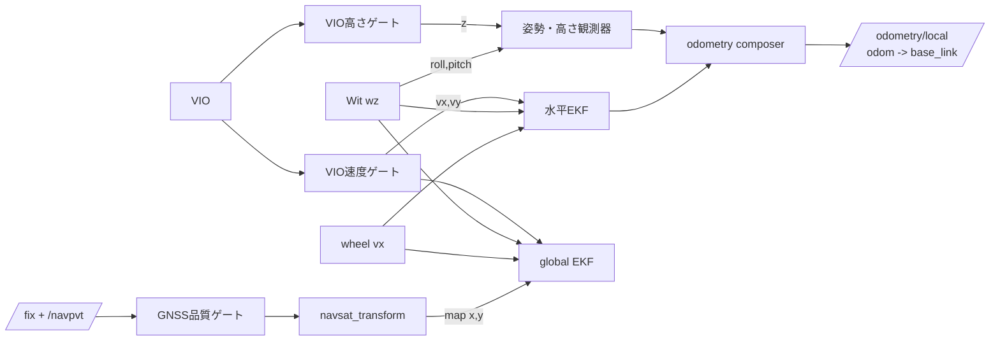

# pm_localization：オフロード向け自己位置推定

`pm_localization`は、車輪・Wit IMU・OpenVINS VIO・GNSSを用いる
Patasmonkeyの自己位置推定用ノード群です。従来互換の`legacy`構成に加え、
VIO破綻や未校正の磁気yawが水平位置を汚染しにくい
`separated_offroad`構成を提供します。

## 運用構成



### local odometry

水平EKFは`/wheel/odometry`の`vx`、`/wit/imu`の`wz`、および正常期間だけを
通すVIO `vx/vy`を使用します。VIO pose・VIO z・Witの連続磁気yawは使いません。
roll/pitchはWit orientationから、zは品質通過VIO zから別に観測し、
`local_odometry_composer_node`が`/odometry/local`へ合成します。

高さゲートが閉鎖された後も`/odometry/local_vertical`は出力を継続しますが、
これは最後に検証済みのzを保持しているだけです。新しいVIO zの追従やIMU加速度の
二重積分は行いません。

### headingとGNSS

単一GNSSアンテナは停止時headingを測れません。そのため
`heading_initializer_node`は、停止中のWit yawを円平均してlocal EKFへ一度だけ
seedします。その後のyawは`wz`で伝播します。`yaw_correction_radians`は、車載後に
実測した取付角・地磁気補正を入れる固定値であり、現在の`0.0`は校正済み値では
ありません。

`gnss_fix_gate_node`は`/fix`と`/navpvt`を検査し、採用したfixだけを
`/fix/gated`へ出します。navsat_transformとdatum初期化はこのtopicだけを使用します。
RTK FIXでない解も一律には捨てず、carrier solution・`h_acc`・入力共分散のうち
最も保守的な水平共分散を付与します。

## 起動

```bash
ros2 launch pm_bringup pm_bag_global_localization.launch.py \
  localization_mode:=separated_offroad
```

起動時は停止を維持し、ログにheading seedとdatum設定の成功が出ることを確認して
から走行します。GNSSは最初の連続正常3サンプルが通るまでglobal EKFへ入りません。

```bash
ros2 topic hz /fix /fix/gated /odometry/gps
ros2 topic echo --once /gnss/fix_gate/diagnostics
```

詳細な設計図とステップ1〜5の経緯は
[`notes/codex_sessions/localization_steps_1_to_5_design.md`](../../notes/codex_sessions/localization_steps_1_to_5_design.md)
を参照してください。

## 関連設定

- `pm_config/config/ekf_local_horizontal_vio_twist.yaml`：水平EKF
- `pm_config/config/ekf_global_gnss_constrained.yaml`：GNSS拘束global EKF
- `pm_config/config/heading_initializer.yaml`：heading seedと固定yaw補正
- `pm_config/config/gnss_fix_gate.yaml`：GNSS採否・共分散下限
- `pm_config/config/navsat_transform_heading_initialized.yaml`：datum待機型navsat

## ビルド

Foxyはホストではなく開発コンテナ内でビルドします。

```bash
docker exec --user 1000:1000 --env HOME=/tmp patasmonkey_foxy_dev bash -lc '
  source /opt/ros/foxy/setup.bash
  source /workspaces/ros2_ws/install/setup.bash
  cd /workspaces/patasmonkey_ws
  colcon build --packages-select pm_localization pm_config pm_bringup
'
```
